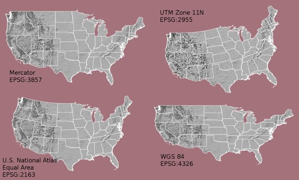
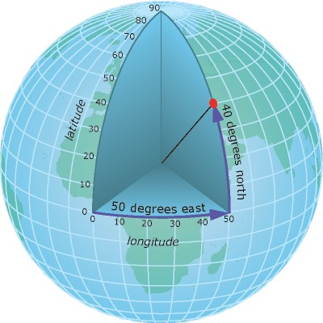
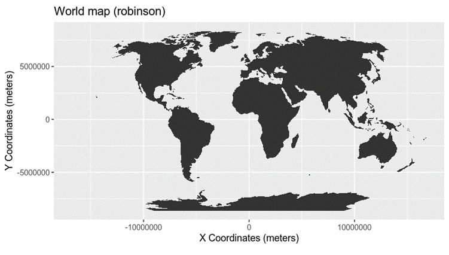
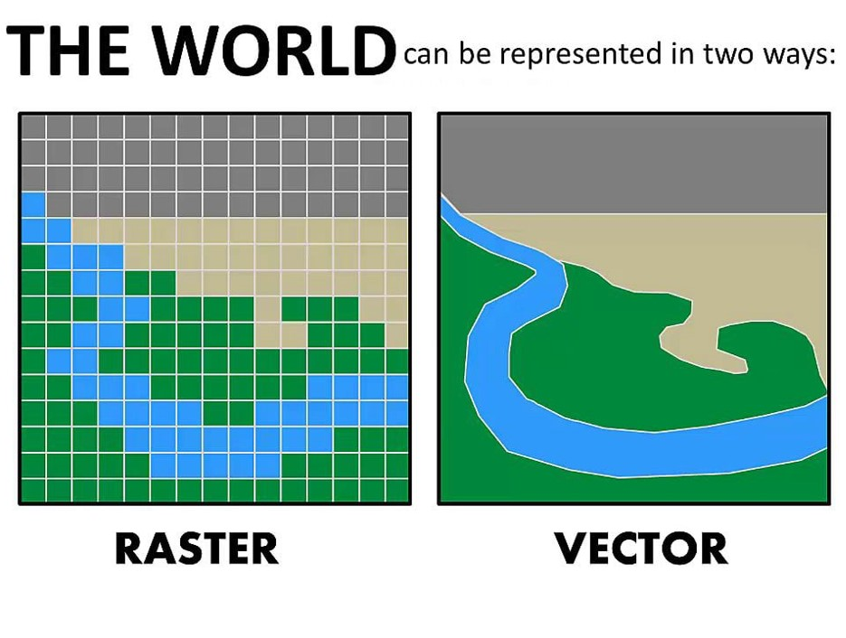

```{r setup, include=FALSE}
knitr::opts_chunk$set(echo = TRUE)
library(sf)
library(ggmap)
library(GISTools)
library(ggsn)
```

# Making maps in R

I've had a lot of people ask me to make maps for them recently. There seems to be a magical aura around cartography where people say "I can't make maps" or "I don't do GIS". It's really not that hard. IF you don't want to pay the big `$$` for an ArcGIS licesne, you can make a quite servicable map with R. 

There are a lot of different packages that you can use for map making, so one of the bigest issues folks have when they are first starting is knowing which package to start with.

'sf' which stands for "simple features" is one of the most user-friendly packages for basic map making (using vector graphics). It was built by the team that brought you the tidyvserse, so you know it's probably good. 

You can check out the website for more info: https://r-spatial.github.io/sf/

## A little background on GIS

In a normal data set, you will have a table where each observation is a row, and each attribute associated with that observation is a column.

We'll use stations from EMP's discrete water quality survey as an example.

```{r}
EMP = read.csv("EMP_Discrete_Water_Quality_Stations.csv")
EMP

```

You will notice that we have one line per station with various attributes, such as Station Type, Location, Latitude, Longitude, and depth. 

(I actually just made up the depths for demonstration purposes, don't use them for anything else)

The columns "latitude" and "longitude" tell you were the stations are, but R won't recognize this as spatial data in this format. We need to identify which columns have the spatial component and what the coordinate reference system is. If you are not familiar with coordinate reference systems, check out [this cheat sheet](https://www.nceas.ucsb.edu/sites/default/files/2020-04/OverviewCoordinateReferenceSystems.pdf)



### Components of a CRS

The coordinate reference system is made up of several key components:

* Coordinate system:The X, Y grid upon which your data is overlayed and how you define where a point is located in space.
* Horizontal and vertical units: The units used to define the grid along the x, y (and z) axis.
* Datum:A modeled version of the shape of the Earth which defines the origin used to place the coordinate system in space. 
* Projection Information: The mathematical equation used to flatten objects that are on a round surface (e.g. the Earth) so you can view them on a flat surface (e.g. your computer screens or a paper map).

### Geographic versus projected CRS

A geographic coordinate system locates latitude and longitude location using angles. Thus the spacing of each line of latitude moving north and south is not uniform. (example, WGS84)



A projected coordinate system locates latitude and longitude using static units. The line spacing is uniform so it is easier to transform and do analyses. However, they are usually only good for a small part of the earth (Example UTM)



We can specify the CRS via a list of the components, or by it's [numeric code](https://spatialreference.org/) . 

EMP uses WGS84, which is number 4326.

```{r}
library(sf)
EMPsf = st_as_sf(EMP, coords = c("Longitude", "Latitude"),  crs = 4326)

EMPsf

```
You will notice that instead of a "latitude" and "logitude" column, we now have a "geometry" column that contains both latitude and longitude. 

Now let's plot these points. 

```{r}
library(ggmap)

ggplot() + geom_sf(data = EMPsf)

```

OK, so that's pretty easy! But it would be nice if we had an outline of the waterways so the points aren't floating out in space. I've got this shapefile of the waterways of teh Delta, and it's pretty easy to import and plot it in sf.

```{r}
waterways = read_sf("hydro_delta_marsh.shp")
waterways
```

Notice that the 'geometery' column says 'polygon' instead of 'point' and it is actually a list with a bunch of points outlining the feature.

```{r}
ggplot() + 
  geom_sf(data = waterways)+ 
  geom_sf(data = EMPsf) 


```

## Tweaking the output


Excellent! Now let's change some things. Fortunately, the 'ggmap' package can accept any of the ggplot themes, and all of the ggplot calls you might already know. You can also vary the shape, size, and color of the elements.

```{r}
ggplot() + 
  geom_sf(data = waterways)+ 
  geom_sf(data = EMPsf, aes(color = StationType, size = AverageDepth)) +
  theme_bw()


```

We usually want a scale bar and north arrow on our maps. There are nice little built-in fucntions in the package "ggsn" that will do that for you.


```{r}
library(ggsn)


ggplot() +
  geom_sf(data = waterways)+ 
  geom_sf(data = EMPsf, aes(color = StationType, size = AverageDepth)) +
  theme_bw()+
  
  #You can adjust the size, units, etc of your scale bar.
 scalebar(data = EMPsf, dist = 20, dist_unit = "km",
           transform = TRUE, st.dist = .1) +
  
  #there are a number of different options for north arrow symbols. ?north
  north(data = waterways, symbol = 2) 

```

## Basemaps

We'd also like a basemap so we can see the rest of the world.

This is also a good opportunity to review rasters versus vectors. Spatial data can either be represented as a grid of equal-sized boxes, with data associated with each box (raster), or a group of polygons, with data associated with each point/line/polygon. The delta waterways shapefile is a vector - each river is made up of a list of points and has lines connecting the points.



Basemaps are usually rasters, rather than vectors, and have very little information associated with them. Each pixel just has a color associated with it, so it's just a picture of a map.

There are a number of free basemap sources online, including Google Maps, but Stamen maps are one of the easiest to work with.

```{r message = FALSE}

#download your map from online
basemap = get_stamenmap(bbox = c(left = -122.6, 
                                 right = -121.0, bottom = 37.4, top = 38.7),
                        maptype = "terrain")

#use "ggmap" rather than "ggplot" to work with the basemap

ggmap(basemap)+ #plot the basemap
  
geom_sf(data = waterways, inherit.aes = F)+ #add teh waterways. Be sure to use "inherit.aes=F"
  
  geom_sf(data = EMPsf, aes(color = StationType, size = AverageDepth),inherit.aes = FALSE) + #add EMP

  #add scalebar and northa rrow
 scalebar(data = EMPsf, dist = 20, dist_unit = "km",
           transform = TRUE, st.dist = .1) +
  scale_color_discrete(guide = "none") +
  north(data = waterways, symbol = 2) +
  
    coord_sf(xlim = c(-122.6,-121),
           ylim = c(37.4, 38.7),
           expand = FALSE)

```
## Labels

We can label our points with `geom_sf_text` and add annotations with "annotate"

```{r}

ggmap(basemap, darken = c(.5, "white"))+ #plot the basemap and lighten it a little
  
  geom_sf(data = waterways, inherit.aes = F, fill = "lightblue")+ #add the waterways
  
  geom_sf(data = EMPsf, aes(color = StationType, size = AverageDepth),inherit.aes = FALSE) + #add EMP points
  
 scalebar(data = EMPsf, dist = 20, dist_unit = "km",
           transform = TRUE, st.dist = .1) + #add a scale bar
  
  north(data = EMPsf, symbol = 3) + #Add north arrow
  
geom_sf_text(data = EMPsf, aes(label = Station), #label the points
             nudge_x = 0.07, size = 3, #adjust size and position relative to points
             inherit.aes = FALSE,
             check_overlap = T) + #stop labels from being drawn over each other
annotate("text", label = "Yay Maps!", x = -122.2, y = 38.4, size = 8)
```


And there you have it. This map obviously needs a fair amount of work to be beautiful, but you can get it going relatively easily. If you need a copy of the Delta shapefile, check out the "deltamapr" package: https://github.com/InteragencyEcologicalProgram/deltamapr 

