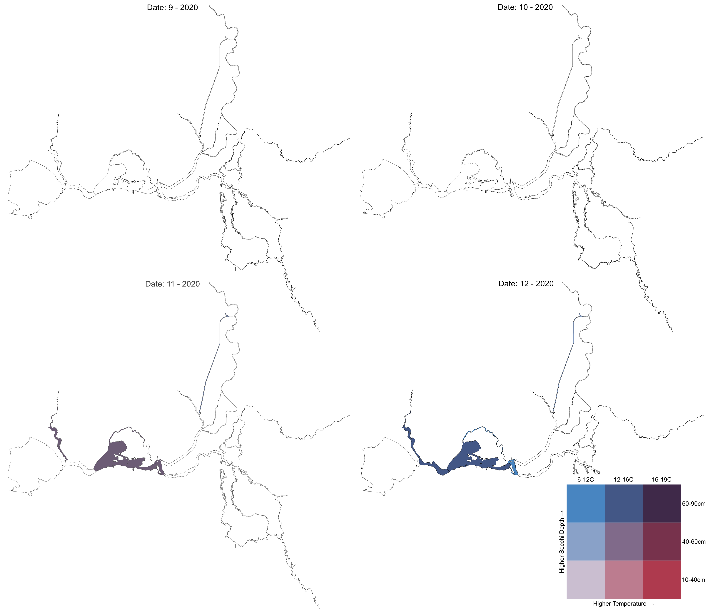

# Introduction

The Fall Midwater Trawl (FMWT) survey has been conducted by the California Department of Fish and Wildlife (CDFW) since 1967. The survey was established to examine relative abundance and distribution of juvenile (typically 6-14 cm FL) pelagic fish species in the San Francisco estuary, focusing initially on age-0 Striped Bass [@stevens1977]. Striped Bass was the initial focus of the survey because it was considered an important sport fish and there were concerns over the environmental changes in the estuary resulting from the development of federal and state water projects and thus a need to develop operating criteria for the water projects that would minimize damage to the bass populations [@stevens1977]. The sampling range for FMWT was spread throughout the Delta downstream to San Pablo Bay because this was the known nursery area for young Striped Bass [@turner1972]. Later, FMWT developed abundance and distribution information for other upper-estuary pelagic fishes, including American Shad, Threadfin Shad, Delta Smelt, Longfin Smelt, and Splittail. FMWT is among the oldest and most spatially broad sampling programs in the estuary, currently sampling 122 stations monthly from September through December (Fig. 1). Trawl sampling ranges from western San Pablo Bay to Hood on the Sacramento River, and from Sherman Lake to Stockton on the San Joaquin River. Since 2009, we also conduct meso- and macro-zooplankton sampling at a subset of 32 stations to better understand the food web dynamics of the local fish community. This additional sampling helps inform if reduced or altered prey abundance is a contributing factor in fish population declines.

With the FMWT sampling annually for over 50 years, this dataset has provided a solid baseline of understanding of relative abundance and distribution trends of fish in the San Francisco Estuary. FMWT is one of many long-running surveys conducted in the San Francisco Estuary, each targeting different species, life stages, and time of year [@tempel2021]. Over 50 peer reviewed publications have used these data and it is frequently used by water managers to determine water export volumes for the multi-billion dollar agricultural industry in the Central Valley and municipal use for over 25 million residents throughout California. Long term studies like the FMWT are important in describing how and why the environment is changing, understanding the regulation and functioning of ecological communities, linking biological patterns to environmental variability, and informing of human influences on ecosystems [@mcgowan1990; @codysmallwood1996; @ducklow2009; @clutton-brocksheldon2010; @magurran2010; @nelson2011; @likens2012; @lindenmayer2012; @hofmann2013; @hughes2017]. For example, FMWT data has helped highlight a dramatic estuary-wide decline in fish populations [@sommer2007; @baxter2010; @nally2010; @thomson2010] and resilience abilities of fish communities to long term drought cycles in the estuary [@mahardja2020].

The objective for this report was to summarize the annual environmental variables and catch patterns that are not reported in other annual memos. The goal of the 2020 field season was to sample all stations safely and efficiently, counting all fish and invertebrates and measuring the fork lengths of the first 50 individuals of a single fish species for each station. Various weather and water quality conditions were also recorded at each station. The first survey began September 8, 2020 and the final survey was completed on December 15, 2020.

<br>

```{r echo=FALSE, fig.cap="Figure 1. Map of FMWT station locations, regional groupings, and station index designations.", out.width = '100%'}

```

<br>

# Methods and Gear

The FMWT trawl net consists of a 12 x 12 ft mouth, 58 ft long, starting with 8 inch mesh near the mouth tapering down multiple mesh sizes to 1/2 inch stretched mesh at the cod end. The net is retrieved obliquely through the water column according to a tow schedule which varies with water depth. Metal planing doors fixed at each corner of the mouth of the net help keep the mouth open during sampling. Further details on sampling methods and gear can be found in the FMWT protocol document (<https://filelib.wildlife.ca.gov/Public/TownetFallMidwaterTrawl/FMWT%20Data/FMWT%20Protocol.pdf>).

The typical unit for reporting catch used below is catch per unit effort (CPUE). For FMWT, we calculate CPUE as total species catch divided by water volume of the trawl (as calculated from flowmeter values) in units of cubic hectares (i.e. catch per cubic hectare; see <https://filelib.wildlife.ca.gov/Public/TownetFallMidwaterTrawl/FMWT%20Data/CPUE%20and%20Index%20Calculation%20Instructions.doc>).

The crew typically includes an Environmental Scientist (ES), a Fish and Wildlife Scientific Aid (Sci Aid), and a Mate. The Mate is responsible for driving and maintaining the boat, while the ES and Sci Aid operate the winches, deploy the net, and conduct all sample collection. The survey currently takes 10-12 days to sample all 122 stations every month.

<br>

# 2020 Field Season

Despite many challenges this year from wildfire smoke from surrounding areas and a Coronavirus Disease 2019 (COVID-19) global pandemic, sampling was nearly complete at 121 fish tows and 31 zooplankton tows (Clark-Bumpus and Mysid nets) for each month of sampling in 2020 (Table 1). The exception was station 721 in Cache Slough, which has become increasingly overgrown with dense aquatic vegetation the past few years. This vegetation completely fouls our gear and makes effective sampling of this station impossible (Fig. 2). Besides routine sampling, additional zooplankton and phytoplankton sampling was conducted at 11 stations biweekly in September and October for the Suisun Marsh Salinity Control Gate study on behalf of the California Department of Water Resources (Table 1). Overall, 2020 sampling contributed to the FMWT annual abundance indices, USFWS Delta Smelt Recovery Index, and DWR Suisun Marsh Salinity Control Gate the DWR Suisun Marsh Salinity Control Gate (SMSCG) special study with addition of phytoplankton samples collected at a subset of stations.

<br>

The 2020 field season was filled with unique challenges due to COVID restrictions and wildfire smoke. In September, 3 field days were skipped due to harmful air quality levels resulting from large wildfires in the surrounding areas (Figure 2). These delays were made up later by running two boats/crews simultaneously, sampling different areas. Further delays were caused by diesel fuel shortages or faulty pumps at local marinas. This required shortened or extra-long days to make detours to other marinas. COVID restrictions prevented staff from carpooling which caused logistical challenges, a shortage of available work vehicles, and schedule changes to accommodate boat moves between marinas.

<br>

```{r echo=FALSE, fig.cap="Figure 2. Challenges during field sampling in 2020. Left: Approximately 200 pounds of invasive aquatic vegetation fouling FMWT net at station 721 in Cache Slough. Right: Poor air quality canceled sampling on September 9, 2020. Photo taken September 9, 2020 at 7:34 am on the Napa River near Vallejo, CA.", out.width = '100%'}

```

```{r include=FALSE}
#libraries
library(tidyverse)
library(ggmap) #devtools::install_github("dkahle/ggmap")
library(lubridate)
library(openxlsx)
library(RColorBrewer)
library(htmlwidgets)
library(plotly)
library(rsconnect)
library(RColorBrewer)
library(heatmaply)
library(cowplot)
library(knitr)
library(kableExtra)
library(flextable)
library(officer)
library(png)

#import data####
df <- read.csv("FMWT 1967-2020 Catch Matrix_updated.csv")
dfa <- read.csv("Sample.csv")
si <- read.csv("StationArea.csv")
gps <- read.csv("FMWT_Station_Locations_current.csv")
regions <- read.csv("all stations.csv")
fl <- read.csv("Length.csv")
```

```{r include=FALSE}
#make stations list as characters
df$Station <- as.character(df$Station)
dfa$StationCode <- as.character(dfa$StationCode)
si$Station <- as.character(si$Station)
regions$StationCode <- as.character(regions$StationCode)

#reformat and rename regions table
regions <- regions %>% 
  rename(Index = Station, Station = StationCode, Region = DSLCM.Region) %>%
  filter(Survey == "FMWT") %>%
  select(Station, Region)

#recode Index stations
df <- df %>% mutate(Index = case_when(Index == 0 ~ "Non-Index",
                               Index == 1 ~ "Index"))
#make copy for all years
dfall <- df

#filter most recent year
y <- max(df$Year)
y <- as.character(y)

df <- filter(df, Year == (max(Year)))

dfa$SampleRowID <- NULL
dfa <- dfa %>% 
  filter(grepl(y, SampleDate, fixed = TRUE)) %>%
  rename(Station = StationCode)
dfa$SampleDate <- as.Date(dfa$SampleDate, "%m/%d/%Y")

#format start and end times
dfa$SampleTimeStart <- substr(dfa$SampleTimeStart, 12, 16)
dfa$SampleTimeStart <- hm(dfa$SampleTimeStart)
dfa$SampleTimeEnd <- substr(dfa$SampleTimeEnd, 12, 16)
dfa$SampleTimeEnd <- hm(dfa$SampleTimeEnd)  

#filter to create index lookup table
si <- si %>%
  select(Station, Index) %>%
  mutate(Index = case_when(Index == 0 ~ "Non-Index",
                                  Index == 1 ~ "Index"))

#add index to dataframe table
dfa <- left_join(dfa, si, by = "Station")
```

```{r include=FALSE}
#summary of stations sampled####
ss <- dfa %>%
  group_by(Station, Index, MethodCode, Gear) %>%
  summarise(
    Number.tows = n()) %>%
ungroup()

#rename by type of net
ss <- ss %>%
  mutate(Type = case_when(MethodCode == "MWTR" ~ "Fish net",
                          Gear == 3 ~ "CB net",
                          Gear == 5 ~ "Mysid net")) %>%
  select(-MethodCode, -Gear)

#pivot wider
ss <- pivot_wider(ss, names_from = Type, values_from = Number.tows, values_fill = 0)

#add station 721 manually if not sampled entire season
ss <- ss %>%
    add_row(Station = as.character(721), Index = "Non-Index", `Fish net` = 0, `CB net` = 0, `Mysid net` = 0, .after = 84)

#salinity control gate stations
scg <- tibble("Station" = as.character(c(605, 707, 706, 704, 802, 513, 508, 519, 602, 416, 606)),
                  "Salinity Control Gate" = 2)

#phytoplankton stations
pp <- tibble("Station" = as.character(c(605, 704, 706, 606, 802)),
                 "Phytoplankton" = 3)

#DS recovery memo stations
dsr <- tibble("Station" = as.character(c(802, 804, 806, 808, 810, 812, 814, 903, 904, 906, 908, 701, 703, 705, 707, 709, 602, 604, 606, 608, 410, 412, 414, 416, 418, 501, 503, 505, 507, 509, 511, 513, 515, 517, 519)),
                  "Delta Smelt Recovery Index" = "Sept-Oct")

#combine all to one table
ss <- ss %>% 
  left_join(., scg, by = "Station") %>%
  left_join(., pp, by = "Station") %>%
  left_join(., dsr, by = "Station") %>%
  left_join(., regions, by = "Station") %>%
  select(Station, Region, Index, `Delta Smelt Recovery Index`, `Fish net`, `CB net`, `Mysid net`, `Salinity Control Gate`, Phytoplankton) %>%
  mutate(across(`Salinity Control Gate`:Phytoplankton, ~replace_na(.x, 0))) %>%
  mutate(across(`Delta Smelt Recovery Index`, ~replace_na(.x, ""))) %>%
  arrange(match(Region, c("Far West", "West", "North", "South")))

#grab station column to reuse order for other tables
sorder <- ss$Station

#add column totals
ss <- ss %>%
  bind_rows(summarise(.,
  across(.cols = c(5:9), sum, na.rm = TRUE),
  across(.cols = Station, ~"Total")))
```

<br>

```{r echo=FALSE}
ft <- flextable(ss) #%>% theme_zebra()
ft <- autofit(ft) %>% fit_to_width(7.5)

ft <- set_caption(ft, "Table 1.  Number of Fish, Clark-Bumpus (CB), Mysid, and Phytoplankton samples collected at each station during the 2020 Fall Midwater Trawl Survey season conducted monthly September-December.  All planned station sampling were accomplished with the exception of station 721 due to aquatic vegetation preventing sampling.", style = "Table Caption")
ft
```

<br>

# Abiotic variables

## Water clarity

Secchi disk depth (cm) varied considerably across the estuary (Fig. 3). Generally, water was least clear throughout Carquinez Strait (stations in the 400s), Suisun Bay (Stations in the 500-600 range), and the upper portion of the Sacramento River Deep Water Shipping Channel (stations 795-797; DWSC). In September, a southern DWSC station saw an unusually high secchi value of almost 500 centimeters. Water was relatively clear (200-300 cm secchi depth) throughout the southern and eastern stations (stations in the 900s) for the entirety of the survey. Previous studies have documented a negative correlation between fish catch and high Secchi values [@macnally2010], which varies between species. For example, larval Longfin Smelt are more likely to be caught in the secchi depth range of 0-80 cm [@grimaldo2017] and adult Longfin Smelt catch is greatest at depths less than 50 cm [@lewis2019]. @latour2016 found CPUE decreased 75% once secchi depth reach 35, 50, 53, and 112 cm for Delta Smelt, Longfin Smelt, Age-0 Striped Bass, and Threadfin Shad, respectively. Therefore, in the heatmap of secchi values below (Fig. 3), stations with dark purple boxes (\<100 cm secchi depth) represent stations with the highest likelihood of fish occurrence, which quickly decreases as the color scale transitions to blues, greens, and yellow.

<br>

Turbidity (NTU) is a similar but more precise metric of measuring water clarity compared to secchi depth. Higher turbidity values indicate more opaque water. The heatmap of turbidity values during the 2020 FMWT survey (Fig. 4) show a similar pattern as the secchi values. The northern part of the DWSC, northern Suisun Bay/Montezuma Slough, and Carquinez Strait showed the most turbidity while the rest of the estuary was relatively clear.

<br>

```{r include=FALSE}
#secchi summary####
sech <- dfa %>%
  filter(MethodCode == "MWTR") %>%
  group_by(Station, Index, SurveyNumber) %>%
  summarise(
    values = round(Secchi*100,0)
  ) %>%
  ungroup()
#pivot wide
sech <- pivot_wider(sech, names_from = SurveyNumber, values_from = values)

#add row average and se
sech <- sech %>%
  rowwise() %>%
  mutate(
    Average = round(mean(c(`3`, `4`, `5`, `6`)),0),
    SE = round(sd(c(`3`, `4`, `5`, `6`), na.rm = TRUE)/sqrt(sum(!is.na(c(`3`, `4`, `5`, `6`)))),1))

#prepare data for static heatmap
sechh <- sech %>%
  select(., -Index, -Average, -SE) %>%
  rename(September = `3`, October = `4`, November = `5`, December = `6`) %>%
  pivot_longer(., cols = `September`:`December`, names_to = "Survey", values_to = "Secchi") %>%
  add_row(Station = "721", Survey = "September", Secchi = NA) %>% #manually add station 721
  add_row(Station = "721", Survey = "October", Secchi = NA) %>%
  add_row(Station = "721", Survey = "November", Secchi = NA) %>%
  add_row(Station = "721", Survey = "December", Secchi = NA) %>%
  arrange(match(Station, sorder))

stations <- pull(sechh, Station)
stations <- unique(stations)

#static heatmap
heatmapsech <- ggplot(sechh, aes(x = reorder(Survey, desc(Survey)), Station)) +
  geom_tile(aes(fill = Secchi, height = 1)) +
  scale_fill_viridis_c(na.value = "grey80") +
  scale_y_discrete(limits = rev(stations)) +
  theme_minimal() +
  theme(axis.text.y = element_text(size = 7)) +
  xlab("Survey") +
  labs(fill = "Secchi depth \n(cm)")
```

```{r echo=FALSE, dev='png', fig.dim= c(7, 9), dpi= 300, fig.cap= "Figure 3. Heatmap of monthly secchi disk values (cm) recorded during the 2020 FMWT season. Dark purple values represent the most suitable conditions for many fish species with preference for turbidity."}
heatmapsech
```

<br>

```{r include=FALSE}
#turbidity summary####
turb <- dfa %>%
  filter(MethodCode == "MWTR") %>%
  group_by(Station, Index, SurveyNumber) %>%
  summarise(Tur = Turbidity) %>%
  ungroup()

#pivot wide
turb <- pivot_wider(turb, names_from = SurveyNumber, values_from = Tur)

#add row average
turb <- turb %>%
  rowwise() %>%
  mutate(
    Average = round(mean(c(`3`, `4`, `5`, `6`), na.rm = TRUE),1),
    SE = round(sd(c(`3`, `4`, `5`, `6`), na.rm = TRUE)/sqrt(sum(!is.na(c(`3`, `4`, `5`, `6`)))),1))

#prepare data for static heatmap
turbh <- turb %>%
  select(., -Index, -Average, -SE) %>%
  rename(September = `3`, October = `4`, November = `5`, December = `6`) %>%
  pivot_longer(., cols = September:December, names_to = "Survey", values_to = "Turbidity") %>%
  add_row(Station = "721", Survey = "September", Turbidity = NA) %>% #manually add station 721
  add_row(Station = "721", Survey = "October", Turbidity = NA) %>%
  add_row(Station = "721", Survey = "November", Turbidity = NA) %>%
  add_row(Station = "721", Survey = "December", Turbidity = NA) %>%  
  arrange(match(Station, sorder))

stations <- pull(turbh, Station)
stations <- unique(stations)

#static heatmap
heatmapturb <- ggplot(turbh, aes(x = reorder(Survey, desc(Survey)), Station)) +
  geom_tile(aes(fill = Turbidity, height = 1)) +
  scale_fill_viridis_c(na.value = "grey80") +
  scale_y_discrete(limits = rev(stations)) +
  theme_minimal() +
  theme(axis.text.y = element_text(size = 7)) +
  xlab("Survey") +
  labs(fill = "Turbidity \n(NTU)")
```

```{r echo=FALSE, dev='png', fig.dim= c(7, 9), dpi= 300, fig.cap= "Figure 4. Heatmap of surface water turbidity (NTU) recorded during the 2020 FMWT season. Grey values indicate missing data. The northern part of the DWSC, western and northern Suisun Bay were the most turbid regions."}
heatmapturb
```

<br>

## Temperature

Many estuary species have habitat preferences that include a range of suitable water temperatures [@baker1995; @bennett2005; @moyle2004; @swanson2000]. Past research has linked long term seasonal Delta Smelt occurrence with changes in abiotic habitat metrics such as temperature [@feyrer2007b; @feyrer2011a; @nobriga2008a]. Other research has shown adult Longfin Smelt prefer temperatures under 17.8 °C [@hobbs2015], larval Longfin Smelt are most abundant in the 8-12 °C range [@grimaldo2017] and adults are most abundant in water 12-16 °C [@lewis2019]. Also, Longfin Smelt tend to spawn when temperatures are between 7-14.5 °C [@moyle2002] and Delta Smelt are likely to stop spawning once temperatures are greater than 20 °C [@swanson2000].

Besides preferences, there are physiological thermal limitations that have been documented for some species. For instance, @jeffries2016 found Longfin Smelt show a cellular stress response once water temperature is greater or equal to 20 °C and @bennett2005 showed Delta Smelt experience mortality at temperatures above 25 °C.

The heatmap of surface water temperature (Fig. 5) shows temperatures throughout most of the estuary remained very high, possibly at the upper range of thermal tolerance for many fish species throughout September and October. By November, temperatures had cooled a bit, but remained relatively high in most regions except the upper San Joaquin and upper Sacramento Rivers, and the DWSC. By December, the water cooled to preferential levels estuary wide.

<br>

```{r include=FALSE}
#temperature summary####
temp <- dfa %>%
  filter(MethodCode == "MWTR") %>%
  group_by(Station, Index, SurveyNumber) %>%
  summarise(
    Temp = WaterTemperature
  ) %>%
  ungroup()

#pivot wide
temp <- pivot_wider(temp, names_from = SurveyNumber, values_from = Temp)

#add row average
temp <- temp %>%
  rowwise() %>%
  mutate(
    Average = round(mean(c(`3`, `4`, `5`, `6`)),1),
    SE = round(sd(c(`3`, `4`, `5`, `6`), na.rm = TRUE)/sqrt(sum(!is.na(c(`3`, `4`, `5`, `6`)))),1))

#prepare data for static heatmap
temph <- temp %>%
  select(., -Index, -Average, -SE) %>%
  rename(September = `3`, October = `4`, November = `5`, December = `6`) %>%
  pivot_longer(., cols = September:December, names_to = "Survey", values_to = "Temp") %>%
  add_row(Station = "721", Survey = "September", Temp = NA) %>% #manually add station 721
  add_row(Station = "721", Survey = "October", Temp = NA) %>%
  add_row(Station = "721", Survey = "November", Temp = NA) %>%
  add_row(Station = "721", Survey = "December", Temp = NA) %>%
  arrange(match(Station, sorder))

stations <- pull(temph, Station)
stations <- unique(stations)

#static heatmap
heatmaptemp <- ggplot(temph, aes(x = reorder(Survey, desc(Survey)), Station)) +
  geom_tile(aes(fill = Temp, height = 1)) +
  scale_fill_viridis_c(na.value = "grey80") +
  scale_y_discrete(limits = rev(stations)) +
  theme_minimal() +
  theme(axis.text.y = element_text(size = 7)) +
  xlab("Survey") +
  labs(fill = "Temperature \n(°C)")
```

```{r echo=FALSE, dev='png', fig.dim= c(7, 9.5), dpi= 300, fig.cap= "Figure 5. Heatmap of monthly surface water temperature (°C) recorded during the 2020 FMWT season. Grey values indicate missing data. Temperature values at 20 °C or greater induce cellular stress in Longfin Smelt and values above 25 °C induce Delta Smelt mortality, therefore stations in the purple and blue ranges are most suitable. Stations in the green to yellow range are potentially unsuitable for many species."}
heatmaptemp
```

<br>

## Temperature and Water Clarity

Leveraging the 50+ year FMWT dataset, I created a series of regional maps showing Longfin Smelt habitat suitability from combined Secchi and temperature values for 2020 (Fig. 6). This map displays the average monthly temperature and secchi values in the regions FMWT samples and plots these values on a combined color scale. The breaks in this scale were first determined by plotting a cumulative frequency distribution of Longfin Smelt catch over the entire history of the survey compared to temperature and secchi separately (Fig. 7). Then taking the corresponding temperature and secchi values for each of the catch quantiles. These maps show the estuary was largely unsuitable for Longfin Smelt (and likely other species) in September through October. In November, Suisun Bay, Napa River, and the DWSC were in the highest tier of combined temperature and secchi values. By December, Napa River, the greater Suisun region and the DWSC were all more suitable (Fig. 6).

<br>

```{r echo=FALSE, fig.cap="Figure 6. Map showing Longfin Smelt habitat suitability across each month of FMWT sampling in 2020 according to historical catch. White regions indicate values were out of suitable range. The habitat suitability was limited throughout the estuary until November, when Suisun Bay, Napa River, and the DWSC reaches the high end of suitability. By December, the central regions and the DWSC were more suitable.", out.width = '100%'}

```

<br>

```{r echo=FALSE, fig.cap="Figure 7. Cumulative frequency distributions of FMWT Longfin Smelt catch from 1967-2020 with abiotic variables. Left: Associated secchi depth (cm) with catch and quartile values. Right: Associated surface water temperature (C) with catch and quartile values.", out.width = '100%'}

```

<br>

## Salinity

In the San Francisco upper estuary, the low-salinity zone (LSZ, salinity 0.5-6 ppt) is recognized as an important nursery habitat for young fishes, partially due to the relatively high abundances of their zooplanktonic prey [@bennett2005; @kimmerer2002a; @kimmerer2002b] and correlation with water clarity [@schoellhamer2000a; @kimmerer1998]. A few species in the estuary have been documented to modify migration behavior to stay in this preferred salinity zone under different hydrodynamic conditions [@bennett2002; @kimmerer2002a; @kimmerer2002b]. Temporal variability in freshwater outflow regulates the position of the LSZ [@hobbs2006; @jassby1995] which can occur as far west as the Carquinez Strait under high outflow or as far east as the lower Sacramento River and Delta under low outflow conditions [@hobbs2006]. The heatmap of salinity values observed during the 2020 FMWT showed this LSZ remained inland, at the confluence of the Sacramento and San Joaquin rivers and eastward (Fig. 8). Carquinez Strait and Suisun Bay had moderate salinity levels which increased slightly towards the end of the year. This corresponds well with the low outflow observed during this period of a "Below Average" water year as classified by the Department of Water Resources.

<br>

```{r include=FALSE}
#salinity summary####
sal <- dfa %>%
  filter(MethodCode == "MWTR") %>%
  group_by(Station, Index, SurveyNumber) %>%
  summarise(
    Salinity = round((0.36966/(((ConductivityTop*0.001)^-1.07)-0.00074))*1.28156,2) #convert from EC to salinity ppt
  ) %>%
  ungroup()

#pivot wide
sal <- pivot_wider(sal, names_from = SurveyNumber, values_from = Salinity)

#add row average
sal <- sal %>%
  rowwise() %>%
  mutate(
    Average = round(mean(c(`3`, `4`, `5`, `6`), na.rm = TRUE),2),
    SE = round(sd(c(`3`, `4`, `5`, `6`), na.rm = TRUE)/sqrt(sum(!is.na(c(`3`, `4`, `5`, `6`)))),1))

#prepare data for static heatmap
salh <- sal %>%
  select(., -Index, -Average, -SE) %>%
  rename(September = `3`, October = `4`, November = `5`, December = `6`) %>%
  pivot_longer(., cols = September:December, names_to = "Survey", values_to = "Salinity") %>%
  add_row(Station = "721", Survey = "September", Salinity = NA) %>% #manually add station 721
  add_row(Station = "721", Survey = "October", Salinity = NA) %>%
  add_row(Station = "721", Survey = "November", Salinity = NA) %>%
  add_row(Station = "721", Survey = "December", Salinity = NA) %>%  
  arrange(match(Station, sorder))

stations <- pull(salh, Station)
stations <- unique(stations)

#static heatmap
heatmapsal <- ggplot(salh, aes(x = reorder(Survey, desc(Survey)), Station)) +
  geom_tile(aes(fill = Salinity, height = 1)) +
  scale_fill_viridis_c(na.value = "grey80") +
  scale_y_discrete(limits = rev(stations)) +
  theme_minimal() +
  theme(axis.text.y = element_text(size = 7)) +
  xlab("Survey") +
  labs(fill = "Salinity \n(ppt)")
```

```{r echo=FALSE, dev='png', fig.dim= c(7, 9), dpi= 300, fig.cap= "Figure 8. Heatmap of monthly surface water salinity (ppt) recorded during the 2020 FMWT season. Grey values indicate missing data. The low salinity zone (1-6 ppt, dark purple stations) stayed inland upstream of the confluence."}
heatmapsal
```

<br>

## *Microcystis*

The colonial cyanobacteria *Microcystis aeruginosa* was first discovered in the San Francisco Bay estuary in the early 2000s [@lehman2005]. *Microcystis* in high abundance has toxic effects in the local food web, accumulating in dominant zooplankton species [@ger2010] and bioaccumulating up the trophic levels to predatory fish [@lehman2010]. *Microcystis* becomes seasonally abundant during periods of low water flow and high water temperature [@lehman2008]. FMWT assigns a qualitative rank of 1-5 based on visual inspection for flakes (Fig. 9[@morris2013]). During the 2020 FMWT survey, *Microcystis* was found to be in high abundance at stations throughout the southern and eastern Delta and moderate in parts of Carquinez Strait, Suisun Bay, Montezuma Slough, and the lower Sacramento River in September and October (Fig. 10). By November, a handful of stations in the southern Delta still had moderate *Microcystis* levels. In December, the estuary was cool enough where *Microcystis* was not detected anywhere.

<br>

```{r echo=FALSE, fig.align='center', out.width="50%", fig.cap="Figure 9. Qualitative rankings used to assess *Microcystis aeruginosa* blooms on the water surface."}

```

<br>

```{r include=FALSE}
#microcystis ranks####
micro <- dfa %>%
  filter(MethodCode == "MWTR") %>%
  group_by(Station, Index, SurveyNumber) %>%
  summarise(
    mc = as.numeric(Microcystis)
  ) %>%
  ungroup()

#pivot wide
micro <- pivot_wider(micro, names_from = SurveyNumber, values_from = mc)

#add row average
micro <- micro %>%
  rowwise() %>%
  mutate(
    Average = round(mean(c(`3`, `4`, `5`, `6`), na.rm = TRUE),0))

#prepare data for static heatmap
microh <- micro %>%
  select(., -Index, -Average) %>%
  rename(September = `3`, October = `4`, November = `5`, December = `6`) %>%
  pivot_longer(., cols = September:December, names_to = "Survey", values_to = "Microcystis") %>%
  #manually add station 721
  add_row(Station = "721", Survey = "September", Microcystis = NA) %>% 
  add_row(Station = "721", Survey = "October", Microcystis = NA) %>%
  add_row(Station = "721", Survey = "November", Microcystis = NA) %>%
  add_row(Station = "721", Survey = "December", Microcystis = NA) %>%  
  arrange(match(Station, sorder))

stations <- pull(microh, Station)
stations <- unique(stations)

#static heatmap
heatmapmicro <- ggplot(microh, aes(x = reorder(Survey, desc(Survey)), Station)) +
  geom_tile(aes(fill = Microcystis, height = 1)) +
  scale_fill_viridis_c(na.value = "grey80") +
  scale_y_discrete(limits = rev(stations)) +
  theme_minimal() +
  theme(axis.text.y = element_text(size = 7)) +
  xlab("Survey") +
  labs(fill = "Microcystis \n(Rank)")
```

```{r echo=FALSE, dev='png', fig.dim= c(7, 9), dpi= 300, fig.cap= "Figure 10. Heatmap of *Microcystis spp.* rankings recorded during the 2020 FMWT season. Grey values indicate missing data. Scale is a qualitative assessment of *Microcystis* density."}
heatmapmicro
```

<br>

# Fish & Invertebrate Catch

## Fish

The FMWT survey records all species of fish and invertebrates caught in the trawl net having recorded over 100 different species to date. Since the onset of the Pelagic Organism Decline [@sommer2007] in the early 2000s, catch has been concentrated in a few regions of the estuary by a few abundant species. During 2020, Northern Anchovy catch in San Pablo Bay made up most of our catch (Fig. 12). Threadfin Shad was the second must abundant species, mostly caught in the DWSC (Stations 795 & 796), which have only been sampled since 2009. With more years of sampling, this region will soon overtake San Pablo Bay to become the most abundant region. Other relatively abundant species include American Shad and age-0 Striped Bass (Table 2). Other species were caught but comprised less than 1% of the total catch for the year. Lumping the fish species by those used for index calculations, again one can see Threadfin Shad catch in November in the northern region of the estuary (namely the DWSC) comprised most of index species catch (Fig. 11). Here, the contributions of Northern Anchovy are suppressed because it is lumped in with other non-index species with low or zero catch.

The relative abundance and spatial distribution of the species caught is likely related to their life histories. For example, Northern Anchovy are marine opportunists that can occur in brackish waters [@moyle2002], so with 2020 being dry with low outflow, the salinity field was distributed well into San Pablo Bay. Likewise, Threadfin Shad are freshwater opportunists [@moyle2002] and were more abundant in the freshwater regions such as the DWSC.

<br>

```{r include=FALSE}
#create species table
spp <- c("Aequorea spp", "American Shad", "Arrow Goby", "Bat Ray",	"Bay Goby",	"Bay Pipefish",	"Big Skate", "Bigscale Logperch",	"Black Crappie",	"Black Perch",	"Bluegill",	"Broadnose Sevengill Shark",	"Brown Bullhead",	"Brown Smoothhound",	"California Grunion",	"California Halibut",	"California Tonguefish",	"Chameleon Goby",	"Channel Catfish",	"Cheekspot Goby",	"Chinook Salmon",	"Chrysaora fuscensens",	"Comb Jelly",	"Common Carp",	"Crangon Shrimp",	"Delta Smelt",	"Diamond Turbot",	"Dwarf Perch",	"English Sole",	"Flatfish",	"Goby (unid)",	"Golden Shiner",	"Goldfish",	"Green Sturgeon",	"Green Sunfish",	"Grey Smoothhound",	"Hitch",	"Jacksmelt",	"Jellyfish",	"Largemouth Bass",	"Leopard Shark",	"Lingcod",	"Lizardfish",	"Longfin Smelt",	"Maeotias",	"Mississippi Grass Shrimp",	"Mississippi Silverside",	"Moon Jellies",	"Mud shrimp",	"Night Smelt",	"Northern Anchovy",	"Pacific Electric Ray",	"Pacific Halibut",	"Pacific Herring",	"Pacific Lamprey",	"Pacific Pompano",	"Pacific Sanddab",	"Pacific Sardine",	"Pacific Staghorn Sculpin",	"Pacific Tomcod",	"Palaemon spp.",	"Pile Perch",	"Plainfin Midshipman",	"Polyorchis",	"Prickly Sculpin",	"Rainwater Killifish",	"Redear Sunfish",	"Riffle Sculpin",	"River Lamprey",	"Rock Sole",	"Rubberlip Seaperch",	"Sacramento Blackfish",	"Sacramento Perch",	"Sacramento Pikeminnow",	"Sacramento Sucker",	"Sand Sole",	"Shimofuri Goby",	"Shiner Perch",	"Shokihaze Goby",	"Shrimp (unid)", "Scrippsia pacifica",	"Siberian Prawn",	"Silver Surfperch",	"Smelt Family",	"Speckled Sanddab",	"Spiny Dogfish",	"Splittail",	"Spotfin Surfperch",	"Spotted Bass",	"Starry Flounder",	"Steelhead",	"Striped Bass age-0",	"Striped Bass age-1",	"Striped Bass age-2",	"Striped Bass age-3+",	"Surf Smelt",	"Threadfin Shad",	"Threespine Stickleback",	"Topsmelt",	"Tule Perch",	"Unid",	"Wakasagi",	"Walleye Surfperch",	"Warmouth",	"Western Mosquitofish",	"White Catfish",	"White Crappie",	"White Croaker",	"White Sea Bass",	"White Seaperch",	"White Sturgeon",	"Whitebait Smelt",	"Wolf Eel",	"Yellowfin Goby")

#create inverts table
inverts <- c("Aequorea spp", "Chrysaora fuscensens",	"Comb Jelly",	"Crangon Shrimp",	"Jellyfish",	"Maeotias",	"Moon Jellies",	"Mud shrimp",	"Palaemon spp.", "Polyorchis",	"Shrimp (unid)", "Scrippsia pacifica",	"Siberian Prawn")

#rename species
names(df)[21:134] = spp

#fish and invertebrate CPUE####
#pivot wide to long
cpue.all <- pivot_longer(df, cols = spp, names_to = "Species", values_to = "Catch")
cpue.all$Station <- as.character(cpue.all$Station)
cpue.fish.r <- cpue.all #make copy for regional analysis

#CPUE by region####
#fish
#join with cpue table, filter for only fish
cpue.fish.r <- left_join(cpue.fish.r, regions, by = "Station")
cpue.fish.r <- filter(cpue.fish.r, !Species %in% inverts)

#create index spp list
indexspp <- c("American Shad", "Threadfin Shad", "Delta Smelt", "Longfin Smelt", "Striped Bass age-0")

#calculate cpue by region, lump by index spp list
cpue.fish.r <- cpue.fish.r %>%
  mutate(Spp = case_when(
    !Species %in% indexspp ~ "All other Fish",
    TRUE ~ as.character(Species)),
    CPUE = round((Catch/`Tow.Volume..m³.`)*10000,1),
    Survey = case_when(Survey == 3 ~ "Sept",
                       Survey == 4 ~ "Oct",
                       Survey == 5 ~ "Nov",
                       Survey == 6 ~ "Dec")) %>%
  mutate(Survey = factor(Survey, levels = c("Sept", "Oct", "Nov", "Dec")))

#line plot
cpue.fish.plot <- cpue.fish.r %>%
  group_by(Survey, Region, Spp) %>%
  summarise(Average.CPUE = mean(CPUE),
            SE = sd(CPUE, na.rm = TRUE)/sqrt(sum(!is.na(CPUE)))) %>%
  ggplot(aes(x= Survey, y= Average.CPUE, group= Spp, color= Spp)) +
  geom_line() +
  geom_point(size = 1) +
  geom_errorbar(aes(ymin = Average.CPUE-SE, ymax = Average.CPUE+SE), width = 0.2, position = position_dodge(0.05)) +
  scale_fill_brewer(palette = "Dark2") +
  theme_light() +
  theme(legend.position = "right") +
  ggtitle("Regional Fish Catch") +
  xlab("Survey") +
  ylab("Average CPUE +/- SE") +
  labs(color = "Common Name") +
  facet_wrap(~Region)
```

```{r echo=FALSE, dev='png', dpi= 300, fig.dim= c(7, 5.6), fig.cap= "Figure 11. Regional fish catch for the 2020 FMWT survey organized by species used for index calculations. Lines represent monthly average catch per unit effort (CPUE) values and error bars represent +/- standard error."}
cpue.fish.plot
```

\newpage

```{r include=FALSE}
#fish and invertebrate catch####
#create species table
spp <- c("Aequorea spp", "American Shad", "Arrow Goby", "Bat Ray",	"Bay Goby",	"Bay Pipefish",	"Big Skate", "Bigscale Logperch",	"Black Crappie",	"Black Perch",	"Bluegill",	"Broadnose Sevengill Shark",	"Brown Bullhead",	"Brown Smoothhound",	"California Grunion",	"California Halibut",	"California Tonguefish",	"Chameleon Goby",	"Channel Catfish",	"Cheekspot Goby",	"Chinook Salmon",	"Chrysaora fuscensens",	"Comb Jelly",	"Common Carp",	"Crangon spp.",	"Delta Smelt",	"Diamond Turbot",	"Dwarf Perch",	"English Sole",	"Flatfish",	"Goby (unid)",	"Golden Shiner",	"Goldfish",	"Green Sturgeon",	"Green Sunfish",	"Grey Smoothhound",	"Hitch",	"Jacksmelt",	"Jellyfish",	"Largemouth Bass",	"Leopard Shark",	"Lingcod",	"Lizardfish",	"Longfin Smelt",	"Maeotias spp.",	"Mississippi Grass Shrimp",	"Mississippi Silverside",	"Moon Jellies",	"Mud shrimp",	"Night Smelt",	"Northern Anchovy",	"Pacific Electric Ray",	"Pacific Halibut",	"Pacific Herring",	"Pacific Lamprey",	"Pacific Pompano",	"Pacific Sanddab",	"Pacific Sardine",	"Pacific Staghorn Sculpin",	"Pacific Tomcod",	"Palaemon spp.",	"Pile Perch",	"Plainfin Midshipman",	"Polyorchis spp.",	"Prickly Sculpin",	"Rainwater Killifish",	"Redear Sunfish",	"Riffle Sculpin",	"River Lamprey",	"Rock Sole",	"Rubberlip Seaperch",	"Sacramento Blackfish",	"Sacramento Perch",	"Sacramento Pikeminnow",	"Sacramento Sucker",	"Sand Sole",	"Shimofuri Goby",	"Shiner Perch",	"Shokihaze Goby",	"Shrimp (unid)", "Scrippsia pacifica",	"Exopalaemon modestus",	"Silver Surfperch",	"Smelt Family",	"Speckled Sanddab",	"Spiny Dogfish",	"Splittail",	"Spotfin Surfperch",	"Spotted Bass",	"Starry Flounder",	"Steelhead",	"Striped Bass age-0",	"Striped Bass age-1",	"Striped Bass age-2",	"Striped Bass age-3+",	"Surf Smelt",	"Threadfin Shad",	"Threespine Stickleback",	"Topsmelt",	"Tule Perch",	"Unid",	"Wakasagi",	"Walleye Surfperch",	"Warmouth",	"Western Mosquitofish",	"White Catfish",	"White Crappie",	"White Croaker",	"White Sea Bass",	"White Seaperch",	"White Sturgeon",	"Whitebait Smelt",	"Wolf Eel",	"Yellowfin Goby")

#rename species
names(df)[21:134] = spp

#pivot wide to long
ct <- pivot_longer(df, cols = spp, names_to = "Species", values_to = "Catch")

#summary
ct <- ct %>%
  group_by(Species, Survey) %>%
  summarise(
    catch = sum(Catch))

#pivot wide
ct <- pivot_wider(ct, names_from = Survey, values_from = catch, names_prefix = "Survey ")

#rename Survey numbers to months
ct <- rename(ct, September = `Survey 3`, October = `Survey 4`, November = `Survey 5`, December = `Survey 6`)

#extract inverts
inverts <- c("Aequorea spp", "Chrysaora fuscensens",	"Comb Jelly",	"Crangon spp.",	"Jellyfish",	"Maeotias spp.",	"Moon Jellies",	"Mud shrimp",	"Palaemon spp.", "Polyorchis spp.",	"Shrimp (unid)", "Scrippsia pacifica",	"Exopalaemon modestus")

ctinvert <- filter(ct, Species %in% inverts)

#extract fish
ctfish <- filter(ct, !Species %in% inverts)

#add sums and percent fish
ctfish <- ctfish %>%
  rowwise() %>%
  mutate(
    Total = sum(c(September, October, November, December)))

ctfish <- ctfish %>%
  mutate(
    `Total percent` = round(Total/sum(ctfish$Total) *100, 1)) %>%
  arrange(desc(Total)) %>%
  filter(Total > 0)

#add sums and percent inverts
ctinvert <- ctinvert %>%
  rowwise() %>%
  mutate(
    Total = sum(c(September, October, November, December)))

ctinvert <- ctinvert %>%
  mutate(
    `Total percent` = round(Total/sum(ctinvert$Total) *100, 1)) %>%
  arrange(desc(Total)) %>%
  filter(Total > 0)
```

```{r echo=FALSE}
ftctfish <- flextable(ctfish)
ftctfish <- autofit(ftctfish) %>% fit_to_width(7.5)

ftctfish <- set_caption(ftctfish, "Table 2. Total monthly fish catch during the 2020 FWMT season.", style = "Table Caption", html_escape = FALSE)
ftctfish
```

\newpage

## Invertebrates

Similarly, the invertebrate catch was dominated by catch of the Siberian prawn (*Exopalaemon modestus*) followed by *Maeotias* jellies which were mostly caught in the DWSC and together comprised 96% of total catch (Table 3, Fig. 13). Otherwise, *Crangon* shrimp were the third most abundant species caught. Other species comprised less than 1% of the total catch.

Again, life histories of the invertebrates caught likely explain their spatial distribution within the estuary. The Siberian prawn historically has been found estuary-wide, but tends to be found in lower salinity habitat than other shrimps [@brown2014]. *Crangon* shrimp generally are associated with brackish water but can tolerate freshwater [@hatfield1985]. *Maeotias* jellies are considered a brackish species but can tolerate a wide range of temperature and salinity conditions. Increased *Maeotias* abundance, later bloom termination, and increased duration of medusae bloom are associated with conditions of low to moderate salinity (\<1-10 ppt) and higher temperatures (≥19°C; @schroeter2008) which may explain their high abundance in the DWSC in September.

<br>

```{r echo=FALSE}
ftctinvert <- flextable(ctinvert) %>% italic(., i = c(1:3, 5), j = 1, italic = TRUE)
ftctinvert <- autofit(ftctinvert) %>% fit_to_width(7.5)

ftctinvert <- set_caption(ftctinvert, "Table 3.  Total monthly invertebrate catch during the 2020 FWMT season.", style = "Table Caption", html_escape = FALSE)
ftctinvert
```

<br>

```{r include=FALSE}
#fish catch heatmap####
fish <- df %>%
  pivot_longer(cols = spp, names_to = "Species", values_to = "Catch") %>%
  filter(Year == 2020) %>%
  filter(!Species %in% inverts) %>%
  group_by(Station, Survey) %>%
  summarise(
    `Total Catch` = as.numeric(sum(Catch))) %>%
  ungroup()

fish <- fish %>%
  mutate(Survey = case_when(Survey == 3 ~ "September",
                       Survey == 4 ~ "October",
                       Survey == 5 ~ "November",
                       Survey == 6 ~ "December")) %>%
  mutate(Survey = factor(Survey, levels = c("September", "October", "November", "December"))) %>%
  #manually add station 721
  add_row(Station = "721", Survey = "September", `Total Catch` = NA) %>% 
  add_row(Station = "721", Survey = "October", `Total Catch` = NA) %>%
  add_row(Station = "721", Survey = "November", `Total Catch` = NA) %>%
  add_row(Station = "721", Survey = "December", `Total Catch` = NA) %>%
  arrange(match(Station, sorder))

stations <- pull(fish, Station)
stations <- unique(stations)

#static heatmap
heatmapfish <- ggplot(fish, aes(x = reorder(Survey, desc(Survey)), Station)) +
  geom_tile(aes(fill = `Total Catch`, height = 1)) +
  scale_fill_viridis_c(na.value = "grey80") +
  scale_y_discrete(limits = rev(stations)) +
  theme_minimal() +
  theme(axis.text.y = element_text(size = 7)) +
  labs(fill = "Total Fish Catch") +
  xlab("Survey")
```

```{r echo=FALSE, dev='png', fig.dim= c(7, 9), dpi= 300, fig.cap= "Figure 12. Heatmap of raw total fish catch by station recorded during the 2020 FMWT season. Grey values indicate missing data. San Pablo Bay and the northern part of the DWSC had the highest fish catch."}
heatmapfish
```

<br>

```{r include=FALSE}
#invert catch heatmap####
invert <- df %>%
  pivot_longer(cols = spp, names_to = "Species", values_to = "Catch") %>%
  filter(Year == 2020) %>%
  filter(Species %in% inverts) %>%
  group_by(Station, Survey) %>%
  summarise(
    `Total Catch` = as.numeric(sum(Catch))) %>%
  ungroup()

invert <- invert %>%
 mutate(Survey = case_when(Survey == 3 ~ "September",
                       Survey == 4 ~ "October",
                       Survey == 5 ~ "November",
                       Survey == 6 ~ "December")) %>%
  mutate(Survey = factor(Survey, levels = c("September", "October", "November", "December"))) %>%
  #manually add station 721
  add_row(Station = "721", Survey = "September", `Total Catch` = NA) %>% 
  add_row(Station = "721", Survey = "October", `Total Catch` = NA) %>%
  add_row(Station = "721", Survey = "November", `Total Catch` = NA) %>%
  add_row(Station = "721", Survey = "December", `Total Catch` = NA) %>%
  arrange(match(Station, sorder))

stations <- pull(invert, Station)
stations <- unique(stations)

#static heatmap
heatmapinvert <- ggplot(invert, aes(x = reorder(Survey, desc(Survey)), Station)) +
  geom_tile(aes(fill = `Total Catch`, height = 1)) +
  scale_fill_viridis_c(na.value = "grey80") +
  scale_y_discrete(limits = rev(stations)) +
  theme_minimal() +
  theme(axis.text.y = element_text(size = 7)) +
  labs(fill = "Total Invert Catch") +
  xlab("Survey")
```

```{r echo=FALSE, dev='png', fig.dim= c(7, 9), dpi= 300, fig.cap= "Figure 13. Heatmap of raw total invertebrate catch by station recorded during the 2020 FMWT season. Grey values indicate missing data. The northern part of the DWSC had the highest invertebrate catch."}
heatmapinvert
```

<br>

# Acknowledgments

We thank all personnel involved in this project. Their hard work and dedication to accurate and timely data collection has provided continued success for this long running survey.

> Cole Anderson; Spencer Breining-Aday; Christina Burdi; Ken Flowers; Mike Grady; Dave Hull; Spencer Lewis; Paul Macias; Tim Malinich; Chris Newbrough; Steve Slater; Ramiro Soto; and Maria Velazquez

\newpage

# References
