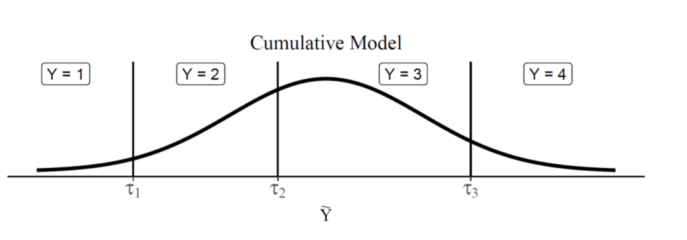
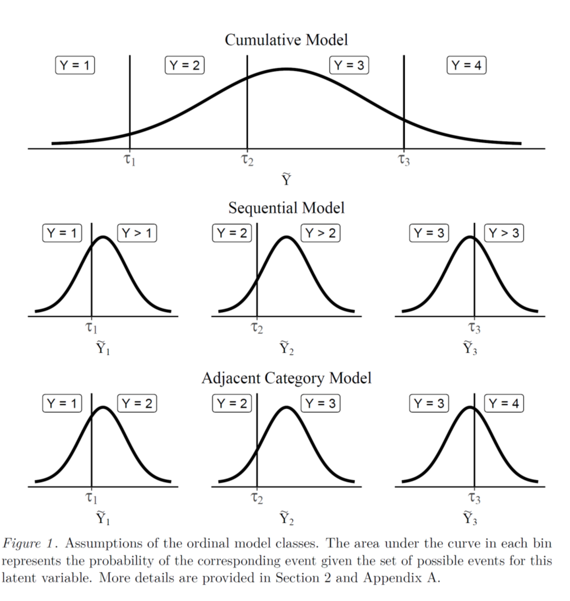
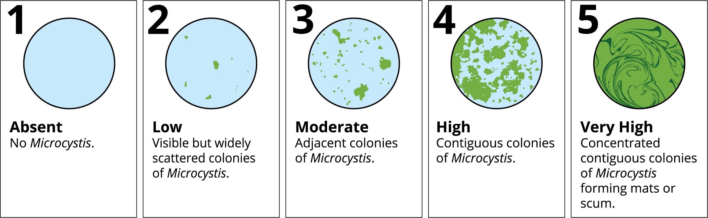

```{r setup, include=FALSE}
knitr::opts_chunk$set(echo = TRUE)
```

## An Introduction to Orginal Regression

Sometimes you have data that is categorized as "low", "medium", and "high". You can turn these into factors for use in a model, but the model will treat them as unrelated, whereas there is probably an underlying distribution behind those values. The probability of "high" is probably closer to the probability of "medium" than to "low". Or something like that. In order to include this information in the model, you need an ordinal regression. 

```{r echo=FALSE, out.width='100%'}

```

This figure, and much of the material in this tutorial comes from:

Bürkner, P.-C., and M. Vuorre. 2019. Ordinal Regression Models in Psychology: A Tutorial. Advances in Methods and Practices in Psychological Science 2(1):77-101. doi:https://doi.org/10.1177/2515245918823199 

This is another good tutorial: https://www.r-bloggers.com/2019/06/how-to-perform-ordinal-logistic-regression-in-r/ 

```{r}
library(tidyverse)
library(devtools)
#install_github("sbashevkin/discretewq")
library(discretewq)
library(MASS)
library(brms)
library(effects)
library(lubridate)
library(ordinal)
library(emmeans)
```

Oridinal regressions are basically extentions of logistic regressions. In simple logistic regression, log of odds that an event occurs is modeled as a linear combination of the independent variables. Ordinal regression uses cumulative events for the log of the odds computation. It means that unlike simple logistic regression, ordinal logistic models consider the probability of an event and all the events that are below the focal event in the ordered hierarchy. 

There are a number of different types of distributions that can be used with ordinal data.

```{r echo=FALSE, out.width='100%'}

```

For this example, we are toing to be using visual Microcystis scores collected from various IEP surveys.

Flynn, T., P. Lehman, S. Lesmeister, and S. Waller. 2022. A Visual Scale for Microcystis Bloom Severity. figshare Figure. doi:https://doi.org/10.6084/m9.figshare.19239882.v1 


```{r echo=FALSE, out.width='100%'}

```

In this case, the cummulative distribution is probably what we want, since "low", "medium", and "high" are mutually exclusive.

Now let's get the data. We can use Sam B's fantastic integrated water quality dataset to automatically download all the survyes the collect Microcystis observations. We'll just do the past five years of data, and limit it to observations in summer and fall, when microcystis is most common.

```{r}

WQ = wq(Sources = c("FMWT", "STN", "EMP"), Start_year = 2015, End_year = 2021) %>%
  dplyr::select(Source, Station, Latitude, Longitude, Date, Depth, Microcystis, 
                Secchi, Temperature, Salinity, Conductivity, Month, Season) %>%
  filter(!is.na(Microcystis), Season %in% c("Summer", "Fall"))
View(WQ)

ggplot(WQ, aes(x = as.factor(Microcystis), y = Temperature)) + geom_boxplot()

```

Cool! So it looks as though there is probably a trend between Microcystis observations and water temperature. However, there is some ammount of variation in how people judge microcystis levels. Let's convert from 5 categories to 3 categories, to try and reduce variability. 

```{r}

WQ = mutate(WQ, Mic = case_when(Microcystis == 1 ~ "Absent",
                                Microcystis %in% c(2,3) ~ "Low",
                                Microcystis %in% c(4,5)~ "High"),
            Mic = factor(Mic, levels = c("Absent", "Low", "High"), ordered = T))

ggplot(WQ, aes(x = Mic, y = Temperature)) + geom_boxplot()


```

OK, now we can set up our model of temperature versus Microcystis. If we have a simple model, we can use the 'polr' function in the MASS package, but the package 'ordinal' allows for mixed models and more complicated controls.

```{r}

mod1 = clm(Mic~Temperature, data = WQ)
summary(mod1)

```
The table displays the value of coefficients and intercepts, and corresponding standard errors z values, and p-values. Holding everything else constant, an increase in Temperature by one degree increases the log odds of Microcystis by 0.3. 

THere are multiple values of intercepts depending on the levels of intercept. The intercepts can be interpreted as the expected odds when others variables assume a value of zero. So the  Absent|Low intercept takes value of 7.9, indicating that the expected odds of absence when temperature is zero is 7.9 times greater than for Low. 

We can plot the effect of temperature:

```{r}
#Plotting the effects 

Effect(focal.predictors = "Temperature",mod1)

plot(Effect(focal.predictors ="Temperature",mod1))


```

This really lets us see how as temperature increases, probability of High microcystis increases, probability of Low microcystis increases, then levels off, and probability of Absence decreases. 

However, there area probably some issues with this model. Temperature is highly correlated with day of the year, and there is probably some spatial autocorrelation going on too. A better model would include multiple predictors and random effects. 


```{r}
#first let's calculate day of year and year to include in the model as a random effect

WQ = mutate(WQ, DOY = yday(Date), Year = as.factor(year(Date)))

mod2 = clmm(Mic ~ Temperature + Secchi + Year + (1|DOY), data = WQ)
summary(mod2)

```

Now let's plot the effects, and do pairwise comparisons between years

```{r}

allEffects(mod2)

plot(allEffects(mod2))


```

```{r}
emmeans(mod2, pairwise ~ Year)
plot(emmeans(mod2, pairwise ~ Year))
```


## Bayesian Approach

We can also use a Bayesian approach. 

We will be using the 'brms' package, which uses stan on the back end. 

There are a lot of great vinettes to help you set it up. The "troubleshooting" one is my favorite. 


```{r}

#Running these models takes FOREVER, so we're going to limit it to just 2020, to make life easier

WQ2020 = filter(WQ, Year == "2020")

M5.1 = brm(Mic ~ Temperature + Secchi +  (1|DOY), data = WQ2020, family = cumulative,
           iter = 1000, backend = "cmdstanr",  
           control = list(max_treedepth = 15),
           chains = 2)
save(M5.1, file = "M5.1.RData")
```
So, it worked, but it takes a while. The more complicated the model, the longer it takes.

```{r}
summary(M5.1)


```
```{r}

cex = conditional_effects(M5.1, categorical = TRUE)
 conditional_effects(M5.1, categorical = TRUE)

```


