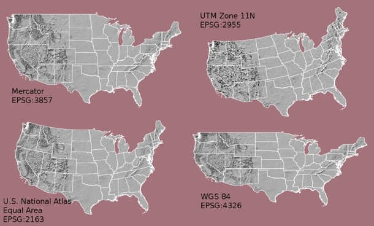
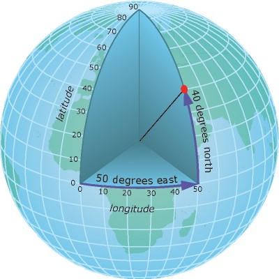
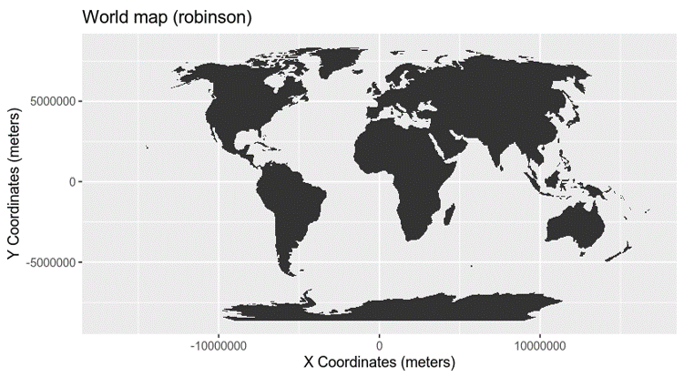
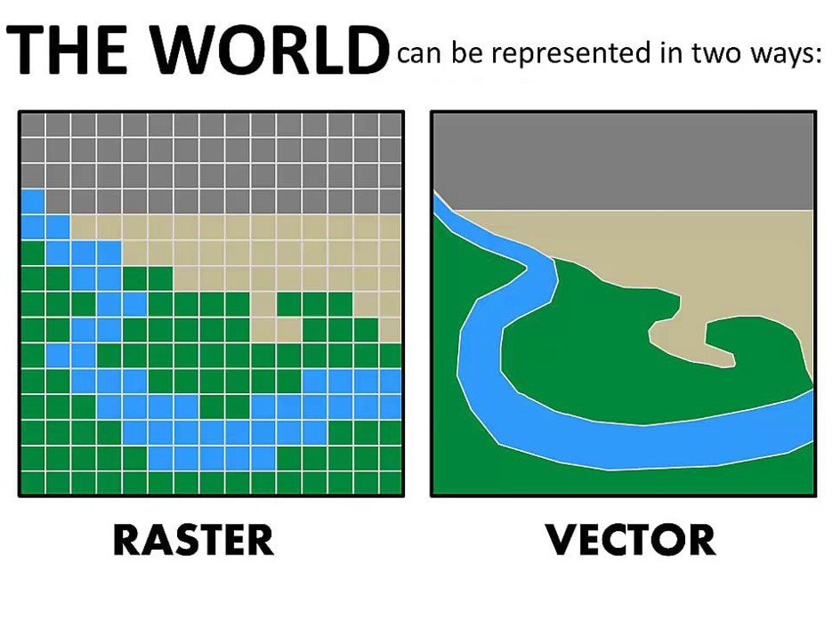

```{r setup, include=FALSE}
knitr::opts_chunk$set(echo = TRUE)
library(sf)
library(ggmap)
library(GISTools)
library(ggspatial)
library(deltamapr)
```

# Making maps in R

I've had a lot of people ask me to make maps for them recently. There seems to be a magical aura around cartography where people say "I can't make maps" or "I don't do GIS". It's really not that hard. If you don't want to pay the big `$$` for an ArcGIS license, you can make a quite serviceable map with R.

There are a lot of different packages that you can use for map making, so one of the biggest issues folks have when they are first starting is knowing which package to start with.

'sf' which stands for "simple features" is one of the most user-friendly packages for basic map making (using vector graphics). It was built by the team that brought you the tidyverse, so you know it's probably good.

You can check out the website for more info: <https://r-spatial.github.io/sf/>

## The deltamapr Package

Before we start making maps, there is a really useful dataset with a lot of the components you might need if you want to make maps of the Delta. It includes outlines of the waterways, regional boundaries, points for all the long-term monitoring programs, and areas of different types of habitat. Let's take a look.

<https://github.com/InteragencyEcologicalProgram/deltamapr>

```{r}

#to install:
#devtools::install_github("InteragencyEcologicalProgram/deltamapr") 
library(deltamapr)

```

## A little background on GIS

In a normal data set, you will have a table where each observation is a row, and each attribute associated with that observation is a column.

We'll use stations from EMP's discrete water quality survey as an example.

```{r}
EMP = read.csv("mapdemo/EMP_Discrete_Water_Quality_Stations.csv")
EMP

```

You will notice that we have one line per station with various attributes, such as Station Type, Location, Latitude, Longitude, and depth.

(I actually just made up the depths for demonstration purposes, don't use them for anything else)

The columns "latitude" and "longitude" tell you were the stations are, but R won't recognize this as spatial data in this format. We need to identify which columns have the spatial component and what the coordinate reference system is. If you are not familiar with coordinate reference systems, check out [this cheat sheet](https://www.nceas.ucsb.edu/sites/default/files/2020-04/OverviewCoordinateReferenceSystems.pdf)



### Components of a CRS

The coordinate reference system is made up of several key components:

-   Coordinate system:The X, Y grid upon which your data is overlaid and how you define where a point is located in space.
-   Horizontal and vertical units: The units used to define the grid along the x, y (and z) axis.
-   Datum:A modeled version of the shape of the Earth which defines the origin used to place the coordinate system in space.
-   Projection Information: The mathematical equation used to flatten objects that are on a round surface (e.g. the Earth) so you can view them on a flat surface (e.g. your computer screens or a paper map).

### Geographic versus projected CRS

A geographic coordinate system locates latitude and longitude location using angles. Thus the spacing of each line of latitude moving north and south is not uniform. (example, WGS84)



A projected coordinate system locates latitude and longitude using static units. The line spacing is uniform so it is easier to transform and do analyses. However, they are usually only good for a small part of the earth (Example UTM)



We can specify the CRS via a list of the components, or by it's [numeric code](https://spatialreference.org/) .

EMP uses WGS84, which is number 4326.

To take our EMP dataset and turn it into a spatial dataframe, we need to specify which columnns contain the x (Longitude) and y (Latitude) values, and which CRS it uses. We'll use the `st_as_sf` function to do this.

```{r}
library(sf)
EMPsf = st_as_sf(EMP, coords = c("Longitude", "Latitude"),  crs = 4326)

EMPsf

```

You will notice that instead of a "latitude" and "longitude" column, we now have a "geometry" column that contains both latitude and longitude.

Now let's plot these points.

```{r}

ggplot() + geom_sf(data = EMPsf)

```

OK, so that's pretty easy! But it would be nice if we had an outline of the waterways so the points aren't floating out in space. A dataset showing the waterways is included in deltamapr.

```{r}
head(WW_Delta)

```

Notice that the 'geometry' column says 'polygon' instead of 'point' and it is actually a list with a bunch of points outlining the feature.

You can also import ESRI shapefiles using the `read_sf` command.

Note that you only need to "point" the function to the `.shp` file, but the accompanying files (`.prj`, `.sbn`, `.sbx`) also need to be in the same location.

```{r}
waterways = read_sf("mapdemo/hydro_delta_marsh.shp")
waterways
```

```{r}
ggplot() + 
  geom_sf(data = WW_Delta)+ 
  geom_sf(data = EMPsf) 


```

One of the really nice things about sf is that you can map datasets with different underlying crs.

In this case, EMPsf is in WGS84, and WW_Delta is in NAD83, but ggplot transformed them for us!

```{r}

st_crs(EMPsf)

st_crs(WW_Delta)

```

## Tweaking the output

Now let's change some things to make our map prettier. `geom_sf` works just like any of the other ggplot2 geometry calls. You can also vary the shape, size, and color of the elements.

```{r}
ggplot() + 
  geom_sf(data = waterways)+ 
  geom_sf(data = EMPsf, aes(color = StationType, size = AverageDepth)) +
  theme_bw()


```

We usually want a scale bar and north arrow on our maps. There are nice little built-in functions in the package "ggspatial" that will do that for you.

```{r}
library(ggspatial)


ggplot() +
  geom_sf(data = waterways)+ 
  geom_sf(data = EMPsf, aes(color = StationType, size = AverageDepth)) +
  theme_bw()+
  
  #You can adjust the size, units, etc of your scale bar.
 annotation_scale() +
  annotation_north_arrow(location = "tl")

```

## Basemaps

We'd also like a basemap so we can see the rest of the world.

This is also a good opportunity to review rasters versus vectors. Spatial data can either be represented as a grid of equal-sized boxes, with data associated with each box (raster), or a group of polygons, with data associated with each point/line/polygon. The delta waterways shapefile is a vector - each river is made up of a list of points and has lines connecting the points.



Basemaps are usually rasters, rather than vectors, and have very little information associated with them. Each pixel just has a color associated with it, so it's just a picture of a map.

There are a number of free basemap sources online, including Google Maps, but Stamen maps are one of the easiest to work with.

```{r message = FALSE}

#download your map from online
basemap = get_stadiamap(bbox = c(left = -122.6, 
                                 right = -121.0, bottom = 37.4, top = 38.7),
                        maptype = "stamen_terrain")

#use "ggmap" rather than "ggplot" to work with the basemap

ggmap(basemap)+ #plot the basemap
  
geom_sf(data = waterways, inherit.aes = F)+ #add teh waterways. Be sure to use "inherit.aes=F"
  
  geom_sf(data = EMPsf, aes(color = StationType, size = AverageDepth),inherit.aes = FALSE) + #add EMP

  #add scalebar and northa rrow
  annotation_scale() +
  annotation_north_arrow(location = "tl")+
  
  #zoom in on just the Delta
    coord_sf(xlim = c(-122.6,-121),
           ylim = c(37.4, 38.7),
           expand = FALSE)

```

## Labels

We can label our points with `geom_sf_text` and add annotations with "annotate"

```{r}

ggmap(basemap, darken = c(.5, "white"))+ #plot the basemap and lighten it a little
  
  geom_sf(data = waterways, inherit.aes = F, fill = "lightblue")+ #add the waterways
  
  geom_sf(data = EMPsf, aes(color = StationType, size = AverageDepth),inherit.aes = FALSE) + #add EMP points
  
 annotation_scale() + #add a scale bar
  
  annotation_north_arrow(location = "tl") + #Add north arrow
  
geom_sf_text(data = EMPsf, aes(label = Station), #label the points
             nudge_x = 0.07, size = 3, #adjust size and position relative to points
             inherit.aes = FALSE,
             check_overlap = T) + #stop labels from being drawn over each other
annotate("text", label = "Yay Maps!", x = -122.2, y = 38.4, size = 8)
```

And there you have it. This map obviously needs a fair amount of work to be beautiful, but you can get it going relatively easily.

## Spatial Operations

Making basic maps in R is useful because you can keep track of the code and repeat as needed, but sometimes things like tweaking labels is easier in a GUI interface (like ArcGIS Pro). However, spatial operations (joins, area, distance, etc) is where R really shines.

For example, if we wanted to associate each of the sampling stations with the name of the underlying river or slough, we can use `st_join`.

```{r, error = TRUE}

EMPsf_withwaterbodies = st_join(EMPsf, WW_Delta)
```

Oh no! they are not in the same coordinate reference system!

ggplot automatically put transformed for plotting, but we will have to put them in the same reference system if we wanted to do any kind of math to them. But don't worry, it's pretty easy with `st_transform`.

```{r}

#transform EMPsf to whatever the CRS of WW_Delta is
EMPsf_trans = st_transform(EMPsf, crs = st_crs(WW_Delta))

#now try joining

EMPsf_withwaterbodies = st_join(EMPsf_trans, WW_Delta)
head(EMPsf_withwaterbodies)
```

OK, now what if we want to know the area of water within a 2km buffer of each of the stations?

```{r}
#twothousand meter buffer around each station
EMP_buff = st_buffer(EMPsf_trans, 2000)
head(EMP_buff)

#note that now it's a polygon instead of a point

#now use st_intersection to calculate the area

EMP_intersect = st_intersection(EMP_buff, WW_Delta)
View(EMP_intersect)

ggplot(EMP_intersect)+
  geom_sf()
```

There you go! This is just a small taste of what is possible. I'm happy to follow up with any questions.
